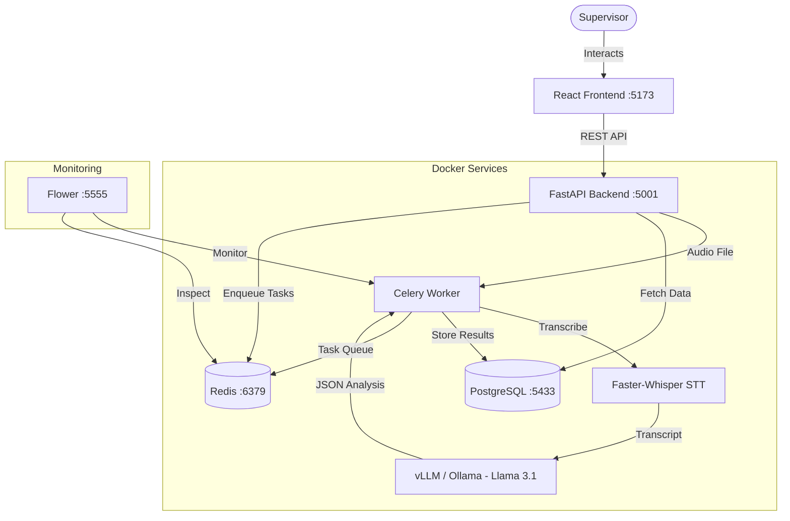

# Enterprise AI Compliance & Voice Auditor

A professional-grade, multi-tenant quality assurance automation platform designed for enterprise call centers. This application utilizes local AI models to transcribe and analyze call recordings, providing supervisors with advanced dashboards, actionable insights, and comprehensive audit trails.

The project demonstrates a production-ready microservice architecture optimized for strict privacy, compliance (HIPAA/GDPR), and complete on-premise data sovereignty.

## Key Architectural Features

- **Multi-Tenant Isolation**: Complete logical tenant separation at database and API middleware levels.
- **Local Audio Processing**: Speech-to-Text (STT) utilizing `faster-whisper` (large-v3) with GPU acceleration, eliminating external transcription costs.
- **Automated QA Evaluations**: Analyzes transcripts against custom criteria weights per Line of Business (LOB) using an OpenAI-compatible local LLM server (running `vLLM` or `Ollama` with Llama-3.1-8B).
- **Asynchronous Task Architecture**: Audio processing, transcription, PII redaction, and LLM scoring queues handled by **Celery** workers with **Redis** as a broker.
- **PII Redaction & Protection**: Automatic, configurable scrubbing of names, phone numbers, emails, and SSNs from transcripts before LLM ingestion, complete with compliance audit logs.
- **Credential Protection**: Symmetric encryption (AES-256) at rest for all external LLM provider API keys.
- **Human-in-the-Loop Validation**: Auditing dashboards allowing supervisor overrides, logged in LLM audit files to track model drift and accuracy.

---

## System Architecture



---

## Technology Stack

| Layer | Technology |
| :--- | :--- |
| **Frontend** | React 19, TypeScript, Vite 8, Tailwind CSS 4, Recharts, TanStack Query |
| **Backend** | Python 3.13+, FastAPI 0.115.11, SQLAlchemy 2.0, Alembic, Pydantic 2 |
| **Database & Cache** | PostgreSQL 17 (with pgvector), Redis 7 |
| **Inference Servers** | vLLM (OpenAI-compatible), Faster-Whisper |
| **Task Queue** | Celery 5.4, Flower 2.0 (Monitoring dashboard) |
| **Containerization** | Docker & Docker Compose (7 services) |

---

## Setup & Deployment

### Prerequisites
- Docker & Docker Desktop
- NVIDIA Container Toolkit (for GPU acceleration support)

### Quick Start
1. Configure your local settings:
   ```bash
   cp .env.example .env
   # Edit .env with your secure database passwords and JWT secrets
   ```
2. Build and start all services:
   ```bash
   docker compose up -d
   ```
3. Access services:
   - **Frontend UI:** `http://localhost:5173`
   - **FastAPI API Docs:** `http://localhost:5001/docs`
   - **Flower Task Monitor:** `http://localhost:5555`

---

## Security & Compliance

This platform was built from the ground up to support highly regulated environments (Legal, Finance, Healthcare):
* **No Cloud Leakage:** Transcriptions are handled 100% locally.
* **PII Redaction Pipeline:** Automatic PII detection runs at the edge (inside Celery workers) before transcripts are processed.
* **Database Encryption:** API credentials for fallbacks or multi-provider models are encrypted in PostgreSQL using symmetric cryptography.
* **Role-Based Access Control (RBAC):** Strict JWT verification separating Administrators, QA Managers, and Agents.
